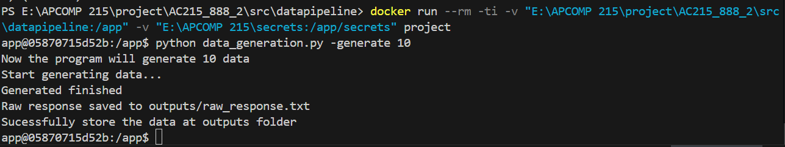
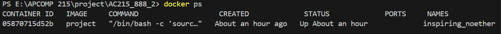

# AC215 - Milestone2

## Team Members
Zilong Wang, Jingxi Zhang, Bruce Zhou, Alice Zhang

## Group Name
AC215_888

## Project Goal
Design and build a web-based tool that uses large language models to help hospitals and healthcare staff efficiently and accurately classify safety incident reports following the HPI methodology.

## Milestone 2
In this milestone, we completed the implementation of two important components of our project:

1. Data Generation
2. Safety event classification

## Data Generation

The dataset contains 100 detailed examples of medical safety incidents and 100 Gemini simulate data. Each entry represents a realistic clinical incident across various hospital departments, including:
- Internal Medicine
- Surgery
- OB/GYN & NICU
- Radiology / Imaging
- Outpatient / Emergency (ER)

The dataset is designed to simulate real-world hospital safety events.

After generation, each case is manually reviewed and labeled into one of four safety event levels:
- SSE (Serious Safety Event)
- PSE (Precursor Safety Event)
- NME (Near Miss Event)
- NSE (No Safety Event)

These labeled data are then used to fine-tune LLMs, enabling hospitals to better identify, classify, and prevent safety incidents — ultimately helping healthcare systems reduce medical errors and improve patient outcomes.

### Prerequisites:

Before running the program, make sure you have:

- Docker Desktop installed and running

- A valid Google service account key (e.g. llm-service-account.json)

- Your should change your working directory into `src/datapipeline` by typing the command line below in your terminal

```bash
cd src/datapipeline
```

### Step 1. Build the Docker Image

Run this command from the folder containing your `Dockerfile`:

```bash
docker build -t data_generation -f Dockerfile .
```

### Step 2. Run the Docker Container
You need to mount two folders into the container:
- Project folder → contains your Python code. This is typically your currently working directory since we have asked you to `cd` into `src/datapipeline`.
- Secrets folder → contains your credentials (e.g., llm-service-account.json). You can choose to store it anywhere you want but by default we assume you stored it under `AC215_888/secrets`.
- For Windows use `${PWD}`
```bash
docker run --rm -ti \
  -v "$(pwd):/app" \
  -v "{Your secrets path}:/app/secrets" \
  data_generation
```

### Step 3. Run the Python Script
Inside the container, run the script with the default number of examples (5):
```bash
python data_generation.py
```
This will use Genimi to generate 5 medical incidents data

Or

You can specify how many incident examples to generate by using the --generate argument
```bash
python data_generation.py --generate 100
```
This will use Genimi to generate 100 medical incidents data


## Safety Event Classification

### Prerequisites

Before running the program, make sure you have:

- Docker Desktop installed and running

- A valid Google service account key (e.g. llm-service-account.json). This service account should at least have Vertex AI access.

- Your should change your working directory to `src/model` by typing the command line below in your terminal

```bash
cd src/model
```

### Step 1. Build the Docker Image
Run this command from the folder containing the `Dockerfile`:

```bash
docker build -t prompt_chaining -f Dockerfile .
```

This will:
1. Install Python 3.11 + system dependencies  
2. Create a non-root user (`app`)  
3. Copy project files from  `/src/model`
4. Install dependencies via `uv sync`

### Step 2. Run the Docker Container
You need to mount two folders into the container:
- Project folder → contains your Python code. This is typically your currently working directory since we have asked you to `cd` into `src/model`.
- Secrets folder → contains your credentials (e.g., llm-service-account.json). You can choose to store it anywhere you want but by default we assume you stored it under `AC215_888/secrets`.

Example command lines:

```bash
docker run --rm -ti \
  -v "$(pwd):/app" \
  -v "$(pwd)/../../secrets:/secrets" \
  prompt_chaining
```
### (Optional) Docker Build & Run in One Step

Alternatively, you can simply run

```bash
./docker-shell.sh
```

in your terminal. However, this shell script by default also assumes that you have stored the secrets under `AC215_888/secrets`.

### Step 3. Run the Python Scripts
In this milestone, we have implemented two features for the purpose of our project.

#### **`prompt_utils.py`**

This python script should have the following command line argument options

```
usage: prompt_utils.py [-h] [-p1] [-p2] [-p3] -f file_path [-n number_of_rows]

Render LLM prompts

options:
  -h, --help            show this help message and exit
  -p1, --prompt1        Render Prompt 1: Determine Deviation from GAPS
  -p2, --prompt2        Render Prompt 2: Determine if Deviation Reached Patient
  -p3, --prompt3        Render Prompt 3: Determine if Deviation Caused Harm
  -f file_path, --file file_path
                        Path to the input incident file (txt, csv, xlsx)
  -n number_of_rows, --limit number_of_rows
                        Number of incident rows to read from the file (defaults to all rows)
```

⚠️ **Required Arguments**

- You **must** specify one of the prompt flags (`-p1`, `-p2`, or `-p3`)

- You **must** also include the `-f / --file` argument to provide the input file path

- The `-n / --limit` argument is optional

**Example Usage**

```bash
# Run Prompt 1 on a prompt 1 test file
python prompt_utils.py -p1 -f prompt_tests/prompt1_test.xlsx

# Run Prompt 2 on a prompt 2 test file with only the first line
python prompt_utils.py -p2 -f prompt_tests/prompt2_test.xlsx -n 1
```


**Output Example:**

```
Incident report 1: No deviation from GAPS occurred
Incident report 2: Deviation from GAPS occurred
```

#### **`safety_event_classifier.py`**

This python script should have the following command line argument options

```
usage: safety_event_classifier.py [-h] [-f file_path]

Run the safety event classifier prompt chain.

options:
  -h, --help  show this help message and exit
  -f file_path, --file file_path  Path to the input incident file
```

⚠️ **Required Arguments**

- There is no required argument. By default, the script will run with `prompt_tests/prompt_chaining_test.xlsx` which contains 6 cases.

**Example Usage**

```bash
# Run safety event classification on the test file
python safety_event_classifier.py -f prompt_tests/prompt_chaining_test.xlsx
```

**Output Example:**

**`chaining_output.csv`**
| incident | gaps_deviation_check | reached_patient_check | harm_level_check | final_classification_code | rationale |
|-----------|----------------------|------------------------|------------------|----------------------------|------------|
| A patient with tuberculosis ... | No | N/A | N/A | NSE | No deviation from Generally Accepted Performance Standards (GAPS). |
| A patient was admitted to ... | Yes | Yes | Yes | SSE | Deviation reached the patient and caused moderate/severe harm or death. |
| An anesthesiologist prepared syringes ... | Yes | No | N/A | NME | Deviation occurred but did not reach the patient. |
| A 65-year-old man with COPD was receiving ... | Yes | Yes | Yes | SSE | Deviation reached the patient and caused moderate/severe harm or death. |
| A 50-year-old man presented to the emergency department ... | Yes | Yes | No | PSE | Deviation reached the patient with no or minimal harm. |
| A patient was receiving care in an OB Clinic ... | Yes | Yes | Yes | SSE | Deviation reached the patient and caused moderate/severe harm or death. |


**`final_report.json`**
```json
  {
    "incident": "A patient with tuberculosis receiving isoniazid therapy under directly observed treatment developed acute hepatitis after 3 months. Liver enzymes were monitored monthly and were normal until the week prior. The medication was discontinued immediately, but the patient developed hepatic failure requiring transfer for transplant evaluation.",
    "gaps_deviation_check": "No",
    "reached_patient_check": "N/A",
    "harm_level_check": "N/A",
    "final_classification_code": "NSE",
    "rationale": "No deviation from Generally Accepted Performance Standards (GAPS)."
  }
```

This file will appear automatically under `outputs/`.

## (TODO) RAG Pipeline

This project features a **Retrieval-Augmented Generation (RAG)** Data Pipeline designed to process the Press Ganey Handbook. The pipeline splits the document into semantic chunks, generates vector embeddings, and indexes them for real-time similarity search. The core data processing logic is implemented in the script: `src/datapipeline/experimental/guideline.py`.

Our next step is to integrate this RAG component into the `prompt_utils.py`. This enhancement will allow the model to retrieve relevant mock hospital policies, clinical guidelines, and best-practice standards before generating its classification.

## Screenshot of running instances 




